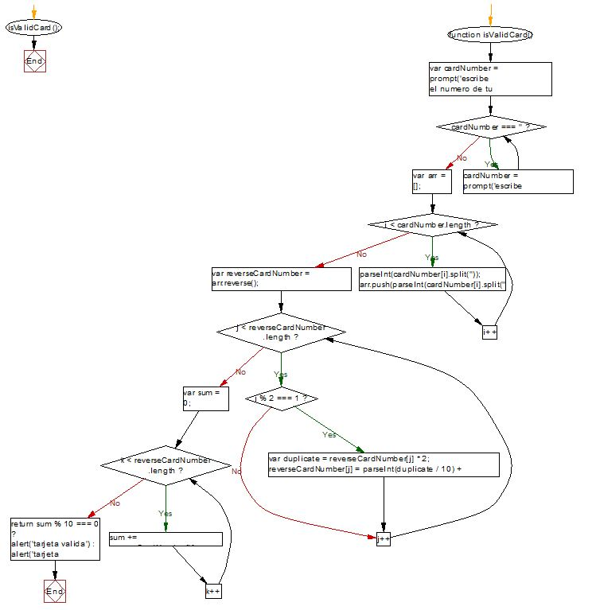

# Valid Credit Card

### In this document we are presenting the the pseudocode and the flowchart for the "Valid Credit Card" method.

#### Proceso isValidCard
####	Escribir card number prompt("escribe numero");
####	Mientras card number = "" (campo vacio);
####    Hacer prompt("escribe numero");
####
####	Leer numero ingresado 4083952015263;
####	cardNumber <- 4083952015263;
####	emptyArray = [] <- declaramos un array vacio;
####	recorriendo cardNumber;
####	emptyArray <-  le asigmanos al array vacio los     numeros de la tarjeta al inverso;
####	reverseCardNumber = 3625102593804 (numeros          inversos se guardan en nueva variable;
####	recorriendo reverseCardNumber;
####	Si numero impar Entonces
####		numeroimpar*2;
####		reverseCardNumber <- (dig1)+(dig2);
####	SiNo
####		numeros pares (no se tocan las posiciones pares);
####	Hacer
####	sumamos al emptyArray los pares intactos e impares modificados;
####	emptyArrayMod = 3321102196804 (declaramos una variable par contener al nuevo arreglo con los impares modificados);
####	sum = 40;
####	Si sum%10=0 Entonces (segun la regla brindada si el modulo de la suma es igual a 0 la tarjeta es valida)
####		Escribir mensaje al usuario "Tarjeta Valida";
####	SiNo
####		Escribir mensaje al usuario "Tarjeta Invalida";
### FinProceso

